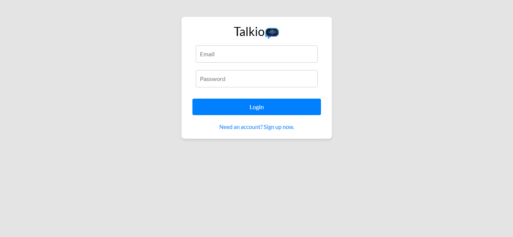
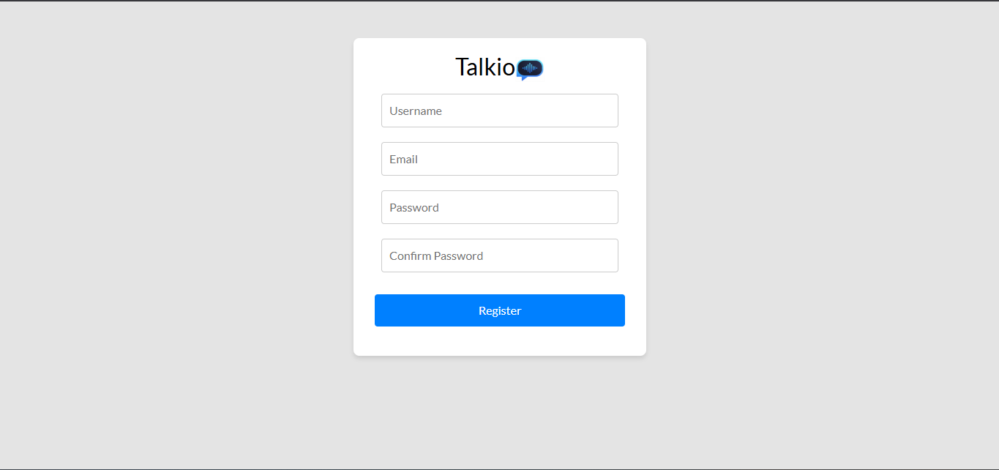
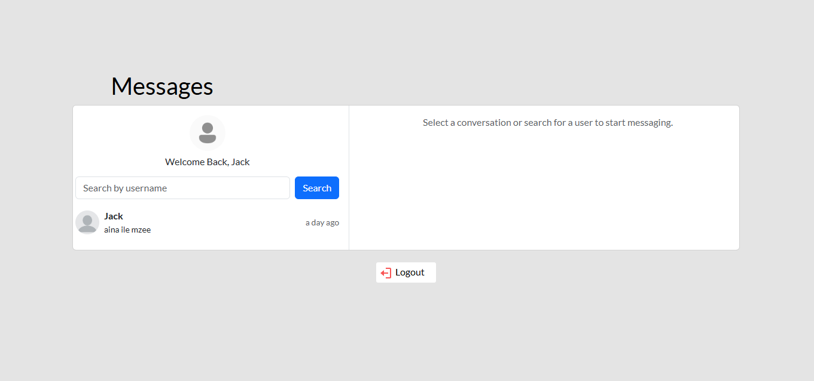
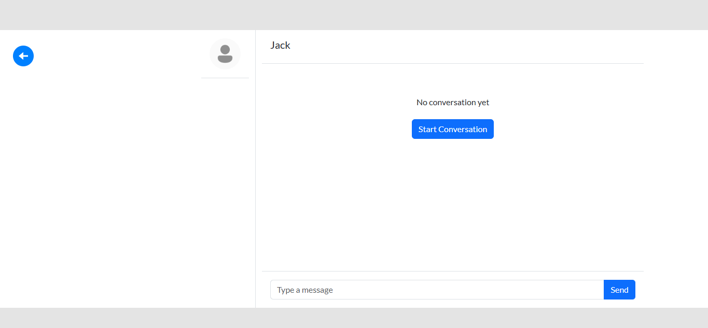

# Talkio
A Chat application built with Django Rest Framework and React
# Features
This project contains the following features: User registration and login, Message, and inbox page.

# Tech Stack
The following languages are used in this project: HTML, JavaScript(React), CSS, Bootstrap and Python(Django Rest Framework).

# Project Screenshots

# Project Setup (Windows users)
1. Clone the project: `git clone https://github.com/CodeOmari/Talkio.git`
2. Open the project in your code editor.
3. In your editor, open terminal and change to the frontend directory: `cd Frontend`, `cd frontend`
4. Install all the frontend dependencies: `npm install`
5. Change directory to the main folder of the project: `cd ..`
6. Install virtual environment: `python -m venv venv`
7. Activate virtual environment: `venv\Scripts\activate`
8. Change directory to the backend folder: `cd Talkio-main`, `cd Backend`
9. Install project requirements from the requirements.txt file: `pip install -r requirements.txt`
10. Run the backend of the project: `python manage.py runserver`
11. Open a new terminal and navigate to the frontend directory: `cd Frontend`, `cd frontend`
12. Run frontend of the project: `npm run dev`

### NB: ANY CONTRIBUTIONS TO THIS PROJECT ARE WARMLY WELCOMED.